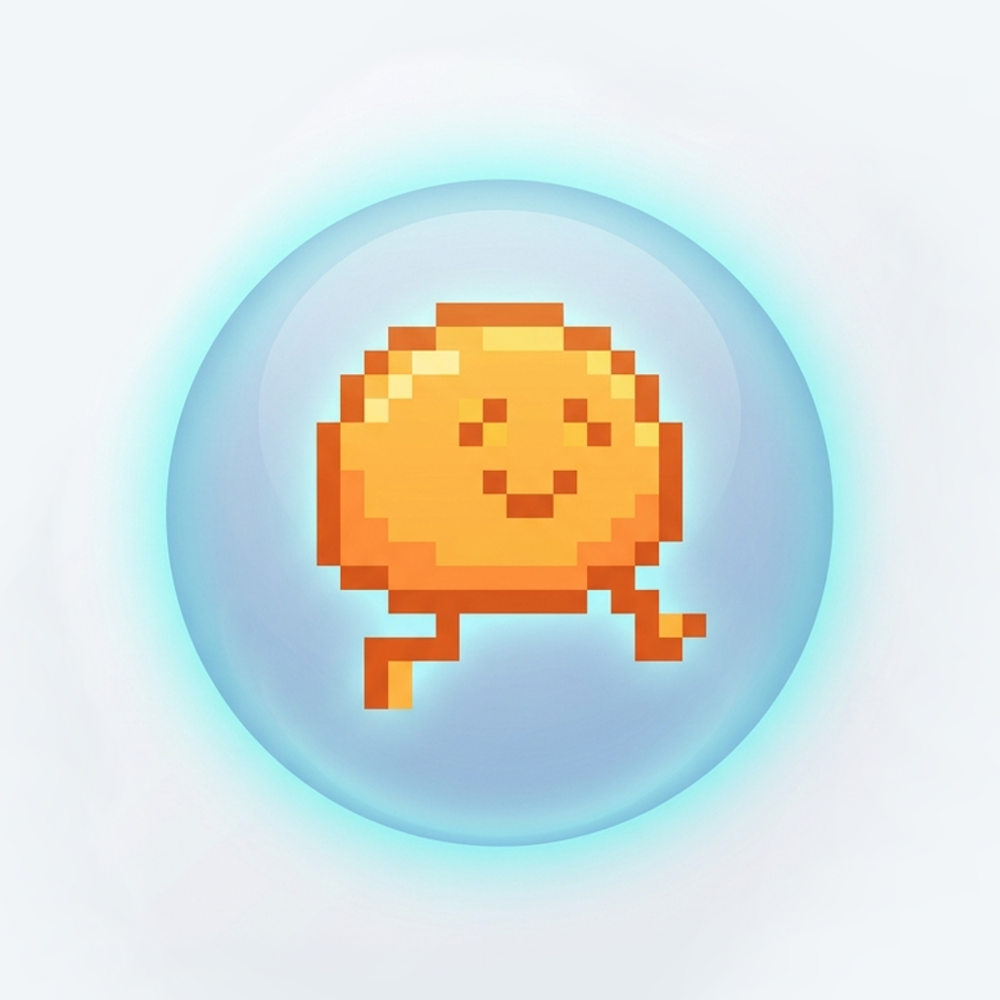

<p align="center">
  
</p>

# Romp

Play retro games from your [RomM](https://romm.app) library, with each game running in its own sandboxed process.

Source and releases: [github.com/RompEmu/RompEmu](https://github.com/RompEmu/RompEmu)

## Running

Requires [rustup](https://rustup.rs) and CMake.

```sh
cargo build --release
./target/release/romp
```

Enter your RomM server address (RomM 5.0 or newer). Approve Romp in RomM by scanning the code or opening the link.

Open a game from your library to download and play it. Romp installs the emulator core it needs, and fetches BIOS files from your server's firmware. Downloaded games stay playable when the server is offline.

In-game saves and save states sync with RomM before and after you play, so you can continue on another device. If a save changed in both places, Romp asks which to keep and backs up the other.

## Controls

- Gamepads are picked up automatically: the first one joins the keyboard as player 1, and each new one becomes the next player.
- Change players or remap any key or button in **Settings → Players**.
- The Guide button, or Select and Start together, opens the game menu.
- In Amiga, DOS, C64 and ZX Spectrum games the keyboard types into the game and F12 opens the menu. Click in the game to use your mouse; F12 releases it.
- Accessories such as the SNES Mouse, Super Scope, Zapper or GunCon are chosen per port in the game menu. A light gun aims where you point and fires with the left button; the right button reloads.

Default keyboard layout:

| Key | Action |
|---|---|
| Arrow keys | D-pad |
| X, Z, S, A | A, B, X, Y |
| Q, W, D, F | L, R, L2, R2 |
| Enter, Backspace | Start, Select |
| F5, F7 | Save, load state |
| F6 | Next save slot |
| P | Pause |
| F11 | Full screen |
| Esc | Game menu |

Your games, saves and library cache are stored in `~/Library/Application Support/Romp` on macOS and `~/.local/share/Romp` on Linux.
